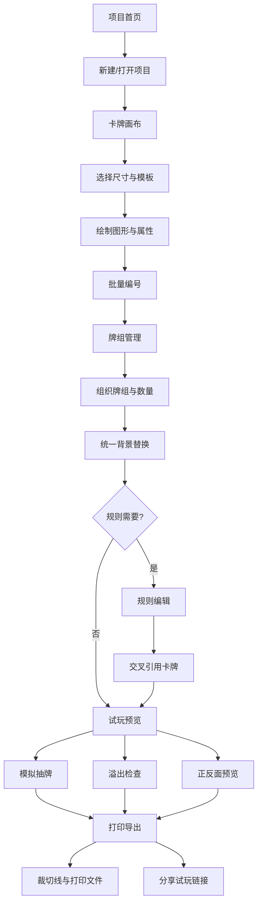

## 1. 产品概述

卡牌工坊（CardForge）是一款面向桌游爱好者的创意设计平台平板端应用，让用户能够从零开始设计自制卡牌、编辑规则页，并完成从创作到打印导出的全流程。目标用户为桌游设计师、DIY卡牌玩家和创意爱好者，解决当前缺乏专业且易用的卡牌设计工具的痛点。

- 核心价值：一站式完成卡牌设计、规则编写、试玩验证和打印输出
- 差异化：专为桌游场景设计的画布编辑器，内置牌面模板和图标库，支持模拟抽牌和文字溢出检测

## 2. 核心功能

### 2.1 用户角色

| 角色 | 注册方式 | 核心权限 |
|------|----------|----------|
| 设计者 | 本地使用即可 | 创建项目、设计卡牌、管理牌组、编辑规则、导出打印 |
| 访客（试玩链接） | 无需注册 | 仅可查看和模拟抽牌 |

### 2.2 功能模块

1. **项目首页**: 项目列表、新建项目、快速操作入口、最近编辑
2. **卡牌画布**: 卡牌尺寸设定、套用模板、绘制图形、属性栏编辑、批量编号
3. **牌组管理**: 牌组创建、数量管理、卡牌分配、统一背景替换
4. **图标库**: 自定义图标导入、分类管理、搜索筛选
5. **规则编辑**: 规则章节编辑、交叉引用卡牌、富文本排版
6. **试玩预览**: 模拟抽牌、文字溢出检查、正反面预览
7. **打印导出**: 裁切线生成、打印文件导出、试玩链接分享

### 2.3 页面详情

| 页面名称 | 模块名称 | 功能描述 |
|----------|----------|----------|
| 项目首页 | 项目网格 | 展示所有项目卡片，支持缩略图预览、项目命名、创建时间 |
| 项目首页 | 新建项目 | 选择卡牌尺寸预设（扑克/塔罗/自定义），输入项目名称 |
| 项目首页 | 快速操作 | 最近编辑项目快捷入口、模板推荐 |
| 卡牌画布 | 画布编辑区 | 拖拽式画布，支持添加文本、图形、图标、图片元素 |
| 卡牌画布 | 卡牌尺寸 | 预设尺寸（扑克63×88mm、桥牌57×89mm、塔罗70×120mm）和自定义尺寸 |
| 卡牌画布 | 牌面模板 | 内置攻击/防御/魔法/事件等模板，一键套用后可自定义修改 |
| 卡牌画布 | 绘制工具 | 画笔、矩形、圆形、线条、箭头等基本图形绘制 |
| 卡牌画布 | 属性栏 | 添加名称/攻击力/防御力/法力值/描述等属性字段，自定义标签和数值 |
| 卡牌画布 | 批量编号 | 自动生成卡牌编号（如 #001-#050），支持前缀自定义 |
| 牌组管理 | 牌组列表 | 展示当前项目所有牌组，拖拽排序 |
| 牌组管理 | 数量管理 | 设置每张卡牌在牌组中的数量，批量调整 |
| 牌组管理 | 卡牌分配 | 将卡牌拖入/移出牌组，实时统计总数 |
| 牌组管理 | 统一背景 | 选择背景图案/颜色，一键替换牌组内所有卡牌背景 |
| 图标库 | 图标分类 | 按类型（元素/种族/状态/装备）分类展示 |
| 图标库 | 导入图标 | 支持SVG/PNG上传，自动识别图标类型 |
| 图标库 | 图标搜索 | 按名称/标签搜索图标 |
| 规则编辑 | 章节管理 | 添加/删除/排序规则章节（如：游戏准备/回合流程/胜利条件） |
| 规则编辑 | 富文本编辑 | 支持标题、正文、列表、加粗、斜体等排版 |
| 规则编辑 | 交叉引用 | 在规则文本中插入卡牌引用，点击跳转至卡牌详情 |
| 试玩预览 | 模拟抽牌 | 从牌组中随机抽牌，支持洗牌动画 |
| 试玩预览 | 溢出检查 | 自动检测卡牌文字是否超出卡牌边界，标记溢出位置 |
| 试玩预览 | 正反面预览 | 同时展示卡牌正面和背面，支持翻转动画 |
| 打印导出 | 裁切线 | 在打印布局上生成裁切标记线和出血区域 |
| 打印导出 | 打印文件 | 导出为PDF/PNG，支持A4/letter纸张，自定义排列密度 |
| 打印导出 | 分享链接 | 生成试玩分享链接，接收方可在线查看卡牌和模拟抽牌 |

## 3. 核心流程

用户打开应用后进入项目首页，创建新项目或打开已有项目。在卡牌画布中设计单张卡牌，选择尺寸和模板，绘制图形、添加属性栏和编号。设计完成后进入牌组管理，组织卡牌到不同牌组并设置数量，可统一替换背景。通过图标库管理自定义图标素材。在规则编辑器中编写游戏规则，可交叉引用卡牌。设计完成后进入试玩预览，模拟抽牌体验、检查文字溢出、预览正反面。最后通过打印导出生成裁切线、导出打印文件或分享试玩链接。

## 4. 用户界面设计

### 4.1 设计风格

- **主色调**: 深色暖调桌面（#1A1614）搭配金色点缀（#D4A853），营造工坊质感
- **辅助色**: 羊皮纸白（#F5E6C8）用于画布和内容区，暗红（#8B3A3A）用于强调和警告
- **按钮风格**: 圆角微凸3D效果，金色边框描边，悬停时发光
- **字体**: 标题使用 MedievalSharp 风格展示字体，正文使用 Noto Sans SC 保证中文可读性
- **布局**: 平板横屏优先，左侧工具栏+中央画布+右侧属性面板的经典三栏布局
- **图标**: 线条风格与实心图标混合，以lucide-react为基础
- **纹理**: 微妙的皮革纹理背景，画布区使用纸张质感，工具栏使用木纹质感

### 4.2 页面设计概览

| 页面名称 | 模块名称 | UI元素 |
|----------|----------|--------|
| 项目首页 | 项目网格 | 卡片式网格布局，3-4列，金色边框卡片，悬停微浮动画 |
| 项目首页 | 新建项目 | 居中模态框，尺寸预设图标选择，金色CTA按钮 |
| 卡牌画布 | 画布编辑区 | 中央白色画布，网格辅助线，元素选中时显示蓝色边框和手柄 |
| 卡牌画布 | 工具栏 | 左侧垂直工具栏，图标+文字提示，当前工具高亮 |
| 卡牌画布 | 属性面板 | 右侧抽屉式面板，分标签页显示属性/图层/历史 |
| 牌组管理 | 牌组列表 | 左侧牌组标签，可拖拽排序，选中高亮金色 |
| 牌组管理 | 卡牌缩略图 | 右侧网格展示，数量角标，拖拽分配 |
| 图标库 | 图标网格 | 瀑布流/等宽网格，上传区域虚线框，分类标签横向滚动 |
| 规则编辑 | 编辑器 | 中央富文本编辑区，顶部格式工具栏，左侧章节大纲 |
| 试玩预览 | 卡牌展示 | 中央卡牌3D翻转效果，底部抽牌按钮带动画 |
| 打印导出 | 打印预览 | A4纸张预览，裁切线红色虚线，右上角导出按钮组 |

### 4.3 响应式设计

- 平板横屏优先设计（1024×768及以上）
- 竖屏时工具栏收起为底部标签栏
- 触控优化：所有可交互元素最小44×44px触控区域
- 支持Apple Pencil/触控笔精细操作

### 4.4 动效设计

- 页面切换：淡入淡出+微滑动
- 卡牌翻转：3D Y轴旋转动画
- 抽牌：卡牌从牌堆飞出动画
- 元素拖拽：吸附网格+弹性回弹
- 按钮：悬停发光+按下缩放
