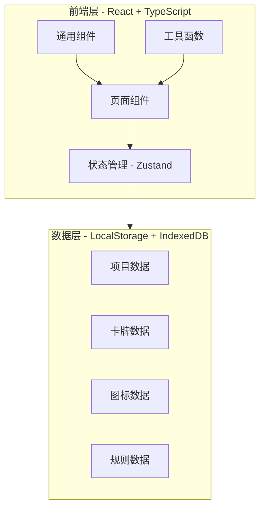
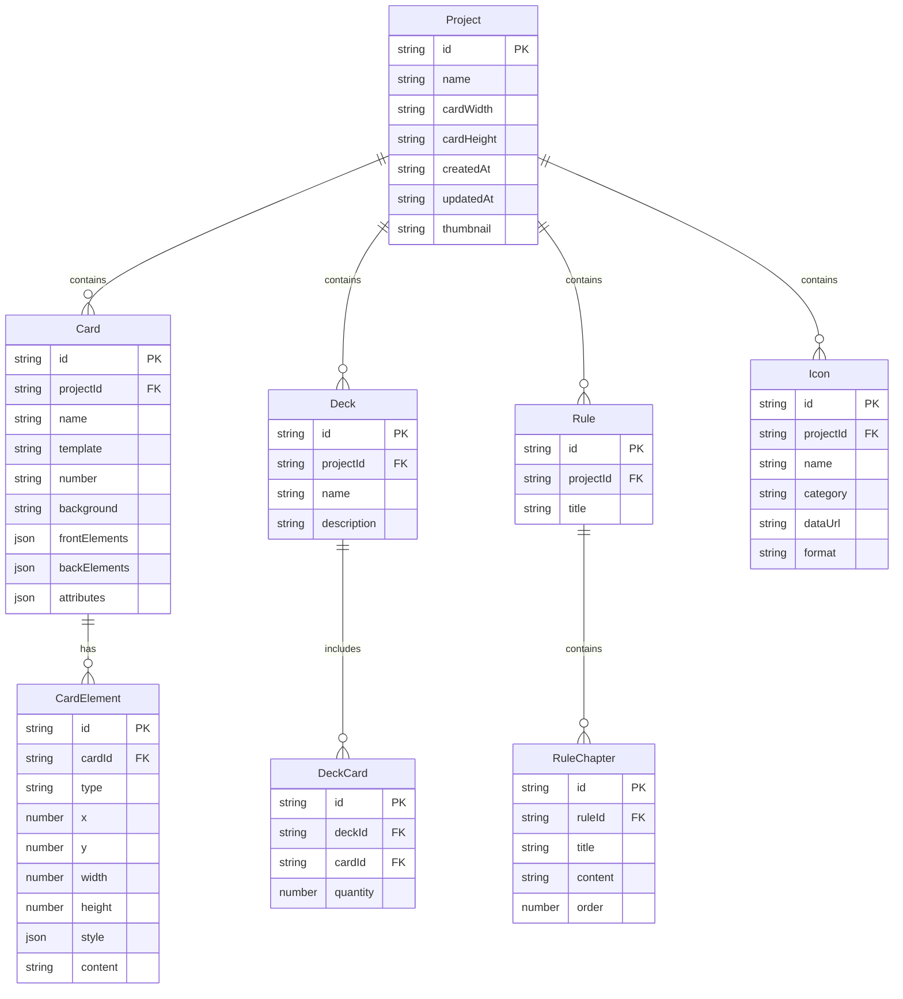

## 1. 架构设计

## 2. 技术说明

- 前端: React@18 + TypeScript + Tailwind CSS@3 + Vite
- 初始化工具: vite-init
- 后端: 无（纯前端应用，数据存储在浏览器本地）
- 数据库: IndexedDB（存储图标等大文件）+ LocalStorage（存储项目和设置）
- 状态管理: Zustand
- 路由: react-router-dom
- 画布引擎: 纯DOM + CSS Transform（轻量级方案，适合平板端）
- 导出功能: html2canvas + jsPDF（打印导出）

## 3. 路由定义

| 路由 | 用途 |
|------|------|
| / | 项目首页，展示项目列表和新建入口 |
| /canvas/:projectId | 卡牌画布，编辑卡牌设计 |
| /decks/:projectId | 牌组管理，组织卡牌和设置数量 |
| /icons/:projectId | 图标库，管理自定义图标素材 |
| /rules/:projectId | 规则编辑，编写游戏规则章节 |
| /preview/:projectId | 试玩预览，模拟抽牌和检查 |
| /export/:projectId | 打印导出，生成打印文件和分享 |

## 4. API定义

无后端API，所有数据操作通过本地存储完成。

## 5. 数据模型

### 5.1 数据模型定义

### 5.2 数据定义

所有数据使用 Zustand store 管理，持久化到 LocalStorage 和 IndexedDB：

- **ProjectStore**: 管理项目的CRUD操作
- **CardStore**: 管理卡牌数据、元素编辑、批量编号
- **DeckStore**: 管理牌组、卡牌分配、数量调整
- **IconStore**: 管理图标导入、分类、搜索
- **RuleStore**: 管理规则章节、交叉引用
- **CanvasStore**: 管理画布状态（选中元素、缩放、撤销重做）

核心数据结构以 TypeScript 接口定义，存储时序列化为 JSON。
